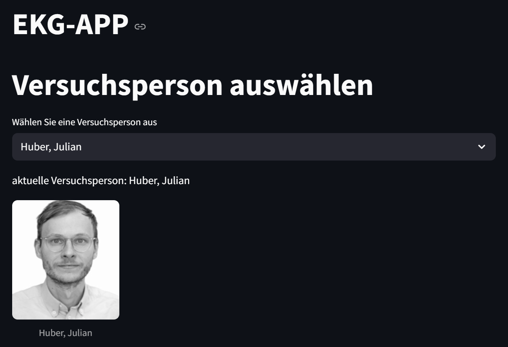

# PUE_GruppeA

# Termin 1: Abgabe 1
Im Rahmen der PÜ2 haben wir in dieser Aufgabe ein neues Projekt in VS-Code erstellt und in ein GitHub Repository gepublished. 

## Projekterstellung mit PDM
Anlegen von `README.md` und `main.py`.

Die Dateien `load_data.py`und `activity.csv` haben wir uns von Julian Hubers Repository kopiert.

Danach haben wir mit PDM ein Projekt angelegt.

## Erklärung des Codes und der Ordnerstruktur
Die aufgezeichneten Daten finden Sie unter `data/activity.csv`.

Pyhton Code im Ordner `src`

Den ausgegebenen Plot finden Sie unter `figures`

## Endprodukt (Plot der Leistungskurve)

# Termin 2:

Im 2. Termin der PÜ SS 2025 haben wir uns mit folgenden Dingen befasst: UML-Klassendiagramm, als auch ein Flow-Chart zu unserem Projekt. 
Außerdem hatten wir eine Einführung in Streamlit und unsere erste Python-basierte Webseite damit erstellt.

Daraus entstanden die Dateien `src/load_user_data.py`, als auch erste Einträge in der `main.py`.

`load_user_data.py` zieht User Daten aus unserer "Datenbank" `data/person_db.json`.

In `main.py` werden Daten wie "Vorname" und "Nachname" benötigt, da sie von Streamlit wieder verwendet werden.

Die Website ist aufrufbar mit dem Befehl: "streamlit run main.py" im Terminal.

## Erstellen eines UML - Dragramms:

## Erstellen eines Flow Charts:

## Screenshot aus Streamlit:

# Termin 3: Abgabe 2

Im 3. Termin ging es darum, einen Interaktiven Plot zu erstellen, und auf unserer Streamlit Site anzuzeigen. Dazu haben wir die Datei `analyze_hr_data2.py`erstellt, welche ihre Daten aus `acivity.csv`zieht. Danach haben wir einen Grafen mit plotly erstellt der uns die Herzrate interaktiv anzeigt, als auch in 5 Zonen einteilt.

Wir haben unsere `main.py` um die funktion "analyze_hr_data" erweitert, dass uns der Graph ebenfalls auf streamlit angezeigt wird.

## Screenshot aus Streamlit:

# Termin 4: Abgabe 3

Im 4. Termin haben wir uns mit Algorithmen beschäftigt.
Hierzu kamen wir zurück zu unserer Leistungskurve aus Termin 1. Diesmal soll diese in einem interaktiven Plot mittels plotly erstellt werden, als auch ein Dataframe der die Leistung in W und die Zeit in s ausgibt. 

Unsere neue Funktion wurde in `src/power_curve_2` erstellt und ist unter der neuen `main_power_array.py` ausführbar.

## Screenshots der Ausgabe aus `main_power_array.py`:

Das Plot zeigt die maximale Dauer an, wo der Benutzer oberhalb einer bestimmten Wattzahl gewesen ist. Hierbei wird immer nur die längste Dauer gezählt, wenn der Benutzer nach Pausen wieder eine Wattzahl erreicht hatte.

# Termin 5 & 6 : Abgabe 4

Im 5. und 6. Termin haben wir uns mit objektorientierte Programmierung beschäftigt.
Dabei haben wir die `load_user_data.py` und `main.py` weitestgehend vereinfacht, um eine übersichtliche "Soft"- gecodete Basis zu haben.

Danach wurde die Datei `ekg_data.py` erstellt, um aus unserer Datenbank `data/person_db.json` die Ekg "ID", "Date" und "result_link" auszulesen.

Diese wurde in eine Klasse "Ekg_tests" übergeben mit welchen folgende Funktionen definiert wurden:

- get_reslult_link()
- load_df_ekg()
- find_peaks()
- estimate_hr()
- plot_time_series()

Danach wird die Klasse in die `main.py` eingepflegt und in Streamlit ausgegeben:

## Ausgabe der EKG-Daten und der Durschnittlichen HF:
