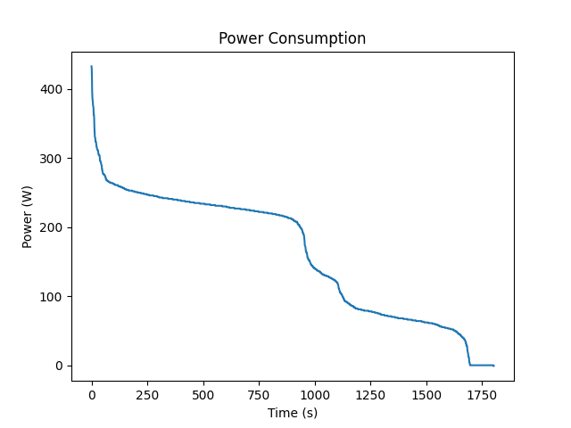

# PUE_GruppeA

# Aufgabe 1
Im Rahmen der PÜ2 haben wir in dieser Aufgabe ein neues Projekt in VS-Code erstellt und in ein GitHub Repository gepublished. 

## Projekterstellung mit PDM
Anlegen von `README.md` und `main.py`.

Die Dateien `load_data.py`und `activity.csv` haben wir uns von Julian Hubers Repository kopiert.

Danach haben wir mit PDM ein Projekt angelegt.

## Erklärung des Codes und der Ordnerstruktur
Die aufgezeichneten Daten finden Sie unter `data/activity.csv`.

Pyhton Code im Ordner `src`

Den ausgegebenen Plot finden Sie unter `figures`

## Endprodukt (Plot der Leistungskurve)

# Aufgabe 2

## Erstellen eines UML - Dragramms für Aufgabe 2:

## Flow Chart:

